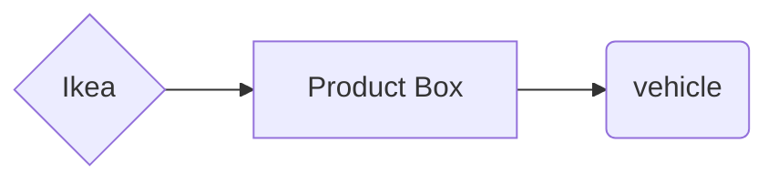

# Will This Fit In My Car

Check if packages or boxes will fit in you car. The ultimate goal is to have a database of Ikea  packed product dimensions and a database of vehicle cargo area dimensions so that you can check the purchase products will fit inside, fit but hang out of the back or will not fit.

Current Progres found [here on GitHub Pages](https://andyfriedl.github.io/will-this-fit/)

- If the the box width, height and depth fit in the cargo area it is added to Fits and get subtracted from the remaining cargo area.
- If the the box width, height fit and depth is longer than cargo area it is added to Fits but will hang out.
- If all dimensions don't fit it is marked as will not fit.

📦 Fits
⚠️ Will hang out
❌ Will not fit

Example output:

    Will this fit in your car - 2010 Jeep Wrangler Unlimited
    
    📦 These boxes will fit inside your Jeep:
    - 60470408: NYSJÖN
    - 20400323: SALJEN
    - 20470047: TIPHEDE
    
    ⚠️ These boxes will fit but hang out of your Jeep:
    - 50311066: FRIHETEN - This box will hangout by 20.5 inches
    - 40104294: LACK - This box will hangout by 1.25 inches
    
    ❌ These boxes don't fit inside your Jeep:
    - 66666666: test
    

